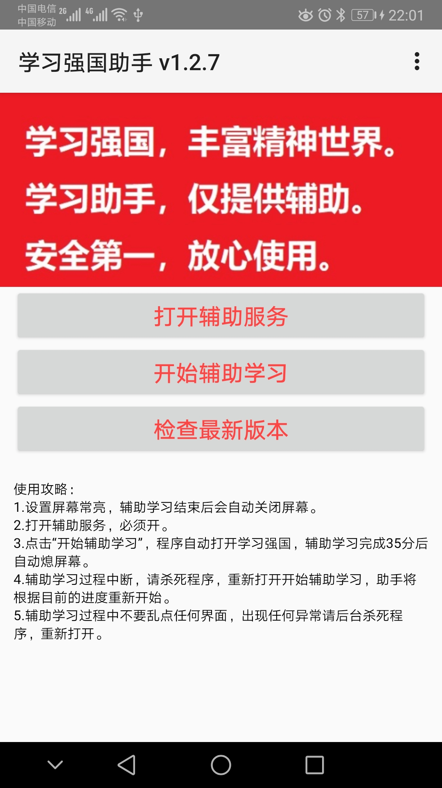
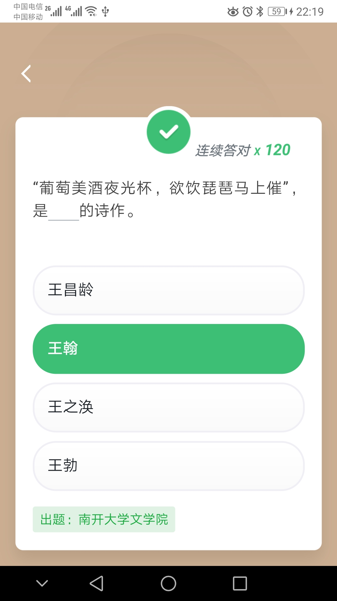
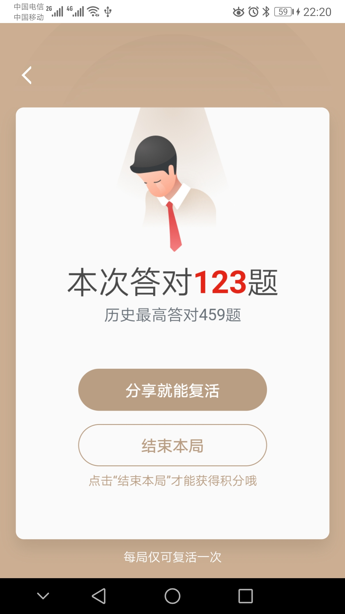

# 学习强国助手-自动学习-自动刷分41分-xuexiqiangguo

 
说明一下设计思路，设计初衷是解决自己学习强国使用过程中的痛点，需要每天重复固定的动作，需要上网搜索答案 
该助手只解决不需要动手点击，不需要上网查找的问题，学习强国里面的内容还是要自己去看的。 
 
 
1.实现自动学习41分，完成每日答题，挑战答题，文章阅读时间、视频观看时间等自动功能。 
2.安全第一，效率第二。 
3.安卓手机应用，估计市场上不去。 
<a href="https://raw.githubusercontent.com/studyhelperhelper/studyhelper/master/studyhelper.apk">apk下载地址</a> 
<a href="https://raw.githubusercontent.com/studyhelperhelper/studyhelper/master/studyhelper.rar">apk压缩包下载地址</a> 

   

学习强国提供了很多有用的视频资料，在学习过程中受益匪浅，为了提高学习效率，解放双手，自己编制了这个助手程序。单纯模拟屏幕点击，不存在违规风险。下一步准备在此基础上另行开发类似“按键精灵的软件”。 
应用主要功能包括： 
1.自动完成视频浏览次数及观看一个长视频18分钟。 
2.自动完成文章浏览，自动深度阅读一篇文章12分钟。 
3.自动收藏。 
4.自动分享。 
5.自动发表评论。 
6.自动完成挑战答题。 
7.自动完成每日答题。 
共可以完成每天41分积分，如果想要满分，可以手动完成专项答题（如有），订阅，每周答题。 
使用方法： 
1.请将手机屏幕设置为常亮。自动完成学习任务后会帮你熄灭屏幕。 
2.每次打开应用都需要打开辅助功能，才能自动点击。 
3.自动学习过程中请不要点击屏幕。 
4.找个空闲时间点一下按钮，轻松完成学习任务。 
5.个人爱好，没有收益，纯玩。 
注意事项： 
1.毕竟没上应用市场，安装前需允许安装未知来源应用。 
2.业余编程，可能有很多bug,由于app初始化需将题库拷贝到本地，由于不懂里面的原理，可能是权限问题，总是因为找不到数据库造成闪退，请耐心多安装几次。实在不行卸载重装，或者覆盖安装试试。 
3.使用过程中出现问题，请后台杀死进程，重新启动试试。 
 
 
2019年9月1日更新： 
1.更新了每日答题功能。正确率有所提高。 
2.修正了一些小bug。 
3.分享功能改为分享到短信。不同手机分享到短信界面不一样，不知道会不会报错。 
  
2019年9月2日更新： 
1.由于不同手机分享到短信，返回步骤不同，分享功能仍分享至微信。如果分享总是出错，建议手动完成分享后再打开自动。已取得满分的项目将不自动进行。 
2.自动完成每天41分的学习。 
3.将已取消的悬浮窗搜索答案功能，保留在右上角菜单中。 
4.增加了挑战答题次数填写。方便使用。
   
